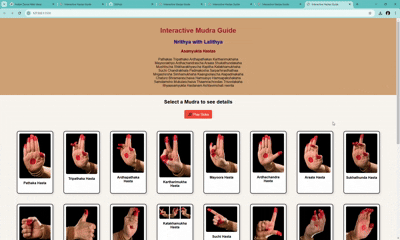
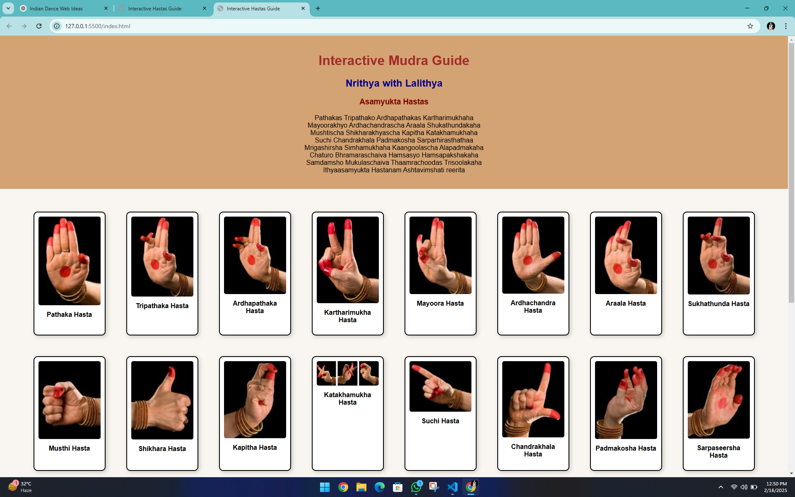

# Interactive Mudra Guide

## 📌 Overview
The **Interactive Mudra Guide** is a web-based application designed to educate users about various Indian classical dance mudras (hand gestures). It provides an intuitive interface where users can click on different mudras to view their names and descriptions. Additionally, the project includes an embedded sloka audio player that plays a relevant sloka related to mudras.

## ✨ Features

- 📖 **Mudra Display:** Various mudras are showcased with corresponding images and names.
- 🎶 **Sloka Audio Player:** Users can listen to a sloka by playing the built-in audio.
- 🎨 **Interactive UI:** Smooth animations and hover effects for a visually appealing experience.
- 🎭 **Click to Reveal Description:** Clicking on a mudra reveals additional details about it.

## 🛠 Technologies Used

- **HTML** - Structure of the web page
- **CSS** - Styling and animations
- **JavaScript** - Interactivity and event handling
## 🎥 Demo
🚀 Live Demo: (https://ramalalithya.github.io/Interactive-Mudra-Guide/) 


## 📸 Screenshots


## 🚀 How to Use

1. Open the `index.html` file in a web browser.
2. Click on any mudra to reveal its description.
3. Press the **Play Sloka** button to start the sloka audio.
4. Enjoy the interactive experience!

## 📂 Project Structure

```
Interactive-Mudra-Guide/
│── index.html          # Main HTML file
│── styles.css          # CSS file for styling
│── script.js           # JavaScript file for interactivity
│── audio/
│   └── sloka.mp3       # Sloka audio file
│── images/
│   ├── suchi.png.jpg   # Example mudra images
│   ├── padmakosha.png.jpg
│   ├── ...
```

## 📜 License
This project is open-source and can be modified or distributed freely.

## 🙌 Acknowledgments
Special thanks to the rich heritage of Indian classical dance and the resources that helped in gathering information about mudras.
